<p align="center">
  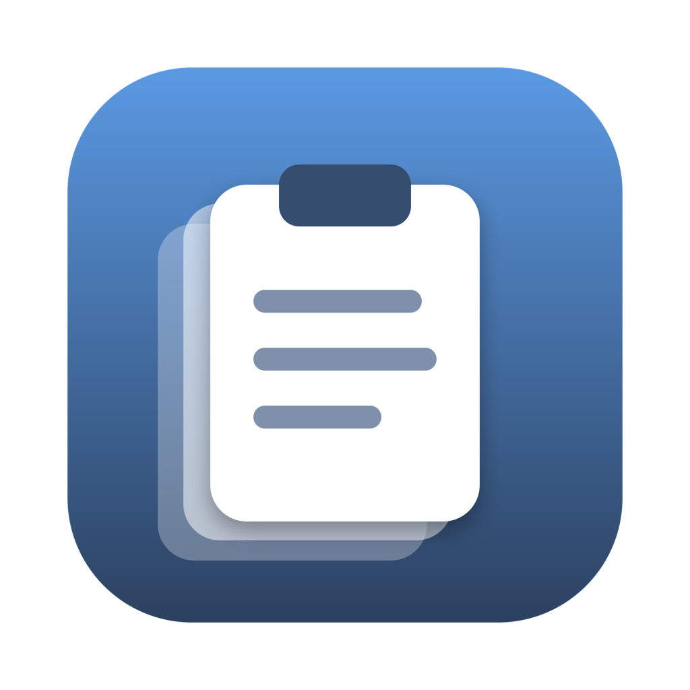
</p>

<h1 align="center">ClipStack</h1>

<p align="center">
  A clipboard manager for macOS. Unlimited history, lives in the menu bar,
  everything stays on your machine.
</p>

<p align="center">
  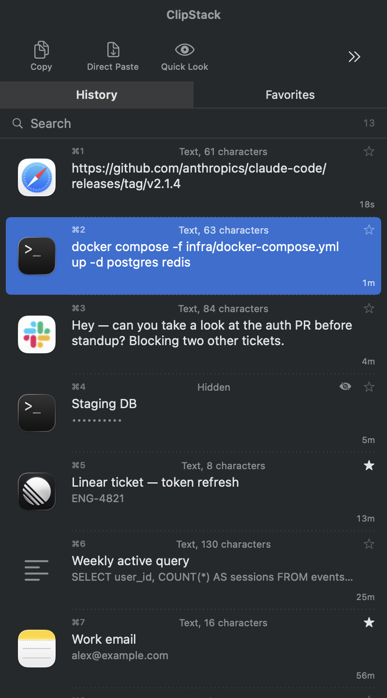
</p>

## Install

Requires macOS 13 or later.

**Download** [`ClipStack.dmg`](https://github.com/Dhayanandh14/copy-stack/releases/latest),
open it, and drag ClipStack into Applications.

The first time you launch it, **right-click the app and choose Open** instead of
double-clicking. ClipStack is signed with a local certificate rather than a paid
Apple Developer one, so macOS wants you to confirm once. After that it opens
normally.

**Or build it yourself** — Command Line Tools are enough, no Xcode:

```bash
git clone https://github.com/Dhayanandh14/copy-stack.git
cd copy-stack
./tools/make-signing-cert.sh
./build.sh install
```

A locally built copy skips the Gatekeeper prompt entirely.

Then press **⌘⇧V** anywhere.

## Screenshots

| History | Favorites |
|---|---|
|  | 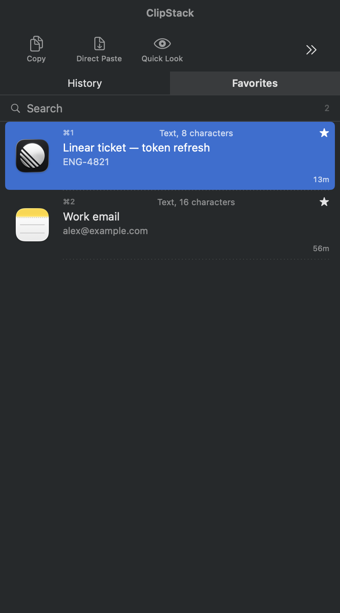 |

| Light appearance | Quick Look, editable |
|---|---|
| 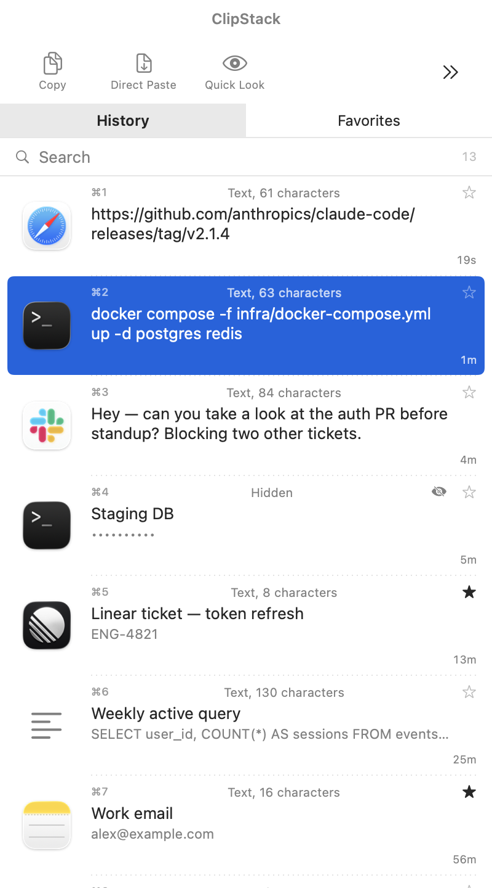 | 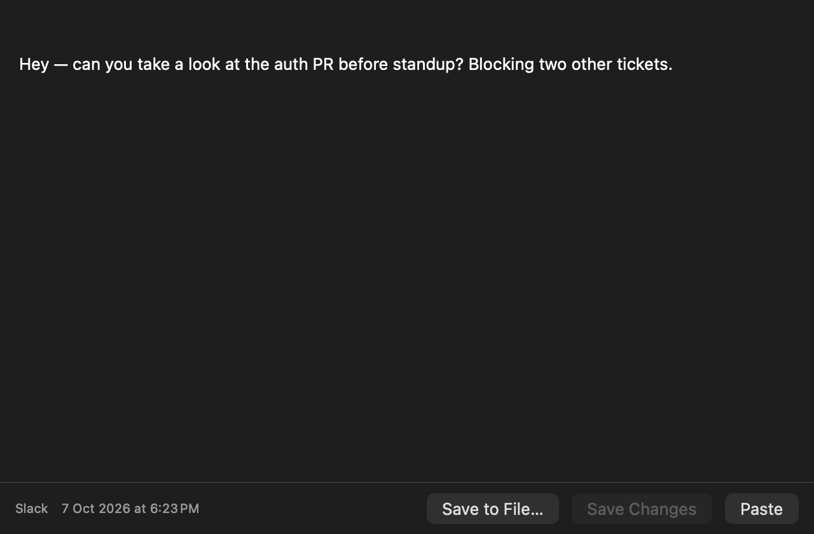 |

| Images | |
|---|---|
| 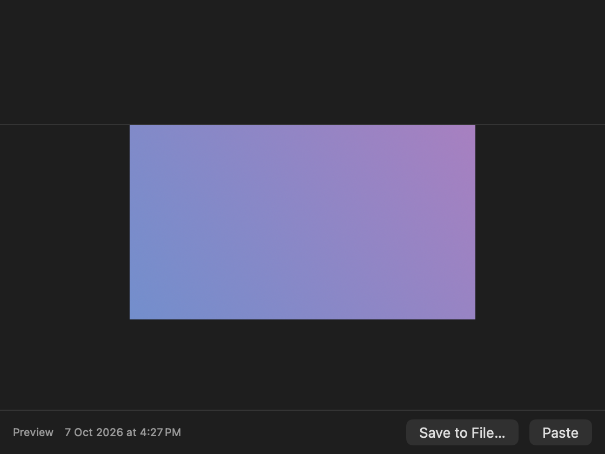 | |

**Settings**

| General | Appearance |
|---|---|
| 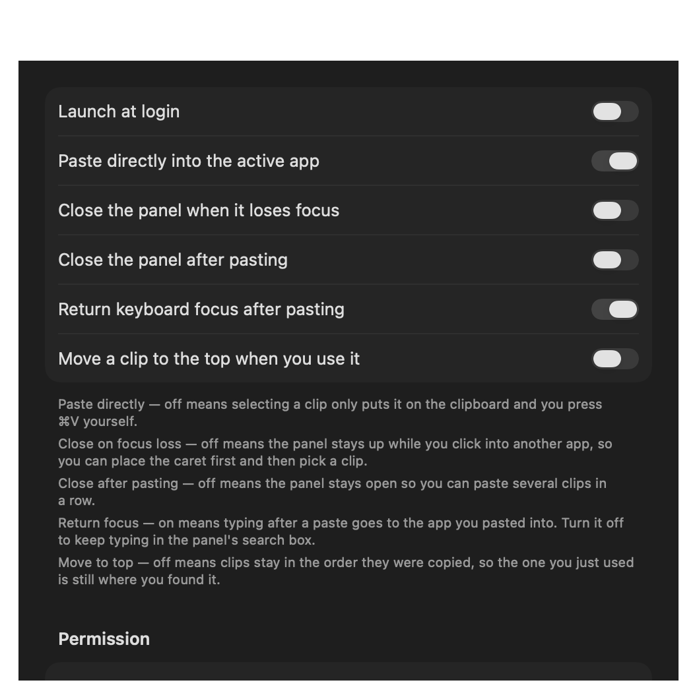 | 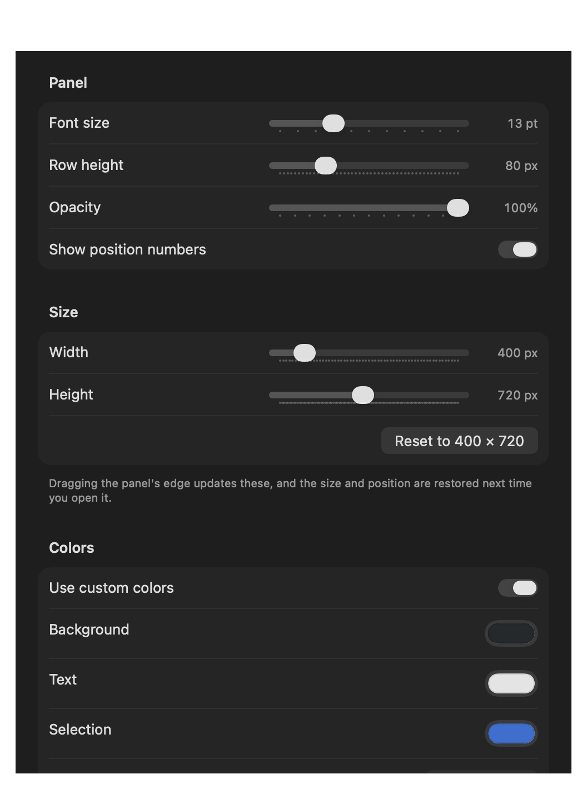 |

| Shortcuts | Privacy |
|---|---|
| 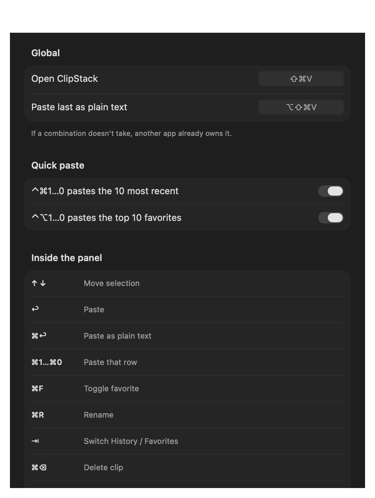 | 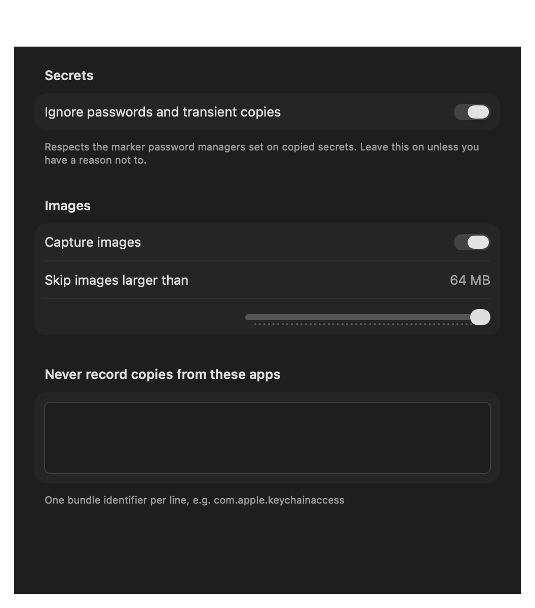 |

| Storage | |
|---|---|
| 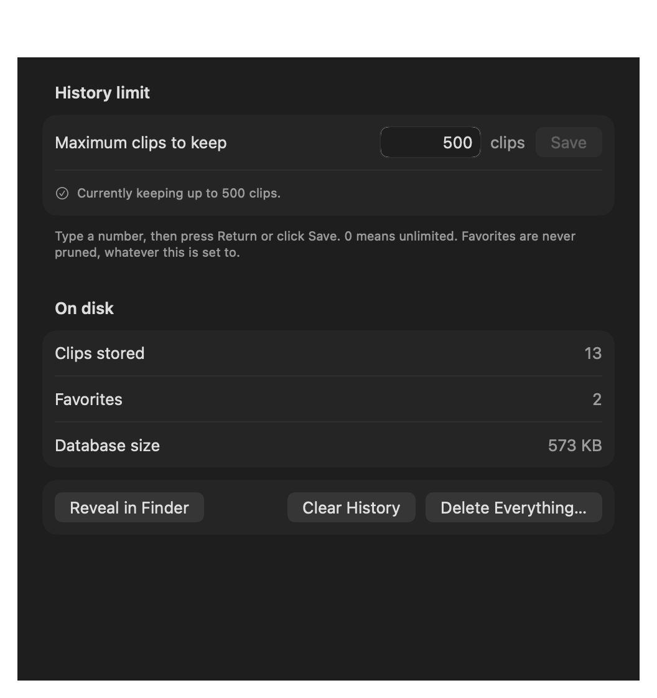 | |

## Using it

One clip per row, newest first. Each row shows where it came from, what kind of
clip it is, and how long ago you copied it.

| Key | |
|---|---|
| `⌘⇧V` | Open |
| `↑` `↓` | Move |
| `↩` | Paste |
| `⌘↩` | Paste as plain text |
| `⌘1`…`⌘0` | Paste that row |
| `⌘F` | Favorite |
| `⌘R` | Rename |
| `⌘Y` | Quick Look |
| `⇥` | History ⇄ Favorites |
| `⌘⌫` | Delete |
| `⎋` | Close |

Without opening the panel: **⌃⌘1…0** pastes a recent clip, **⌃⌥1…0** pastes a
favorite, **⌘⇧⌥V** pastes the last one as plain text. All rebindable.

Right-click a row for the rest — save to a file, and on favorites, change its
icon.

## What it does

**Text, images, rich text and files.** Images get thumbnails and open full size
in Quick Look.

**Favorites** stick around forever and never get pruned. Give one a custom icon
if you want to spot it instantly.

**Quick Look is editable.** Fix a typo or splice two clips together before
pasting — ⌘C, ⌘V, ⌘Z all work in there.

**Rename a clip** to something you'll actually search for later.

**Hide a clip** you'd rather not have on screen — see below.

**Search** stays instant no matter how much history you keep.

## Hiding a clip

Right-click → **Hide Contents** on anything you'd rather not have sitting on
screen. The row masks itself, and clicking the eye brings it back.


<sub>Row 4 above — the title you gave it still shows, the contents don't.</sub>

A name you chose stays visible, because that's how you find the clip again. The
mask is a fixed width and the type line just says "Hidden", so neither one gives
away how long the content was. Hidden images don't show their thumbnail either.

Pasting and Quick Look still give you the real thing — this is about shoulder
surfing, not locking yourself out. The flag sticks to the clip, so it survives
restarts.

## Settings

**General** — launch at login, whether pasting closes the panel, whether the
panel stays open when you click away, and whether focus returns to the app you
pasted into.

**Appearance** — font size, row height, opacity, panel size, and colors. Changes
apply to the open panel immediately, and there's a reset button.

**Shortcuts** — rebind anything.

**Privacy** — see below.

**Storage** — set a maximum number of clips, or leave it unlimited. Favorites are
never pruned either way.

## Privacy

Everything stays on your Mac. No network code, no accounts, no telemetry.

Passwords aren't recorded — ClipStack skips anything marked with the pasteboard
flag password managers use. You can also exclude specific apps by bundle ID.

History lives in `~/Library/Application Support/ClipStack/history.sqlite`,
readable only by you. It isn't encrypted — it's a plain SQLite file, the same as
every other clipboard manager — so treat it like any other file holding things
you've copied.

## Accessibility

Needed only so ClipStack can press ⌘V for you. Without it, picking a clip just
puts it on the clipboard and you paste yourself.

Grant it in System Settings → Privacy & Security → Accessibility. If your Mac is
managed and that's blocked, turn off "Paste directly into the active app" and
everything else still works.

## How it works

macOS has no "clipboard changed" notification, so ClipStack polls
`NSPasteboard.changeCount` a few times a second and reads the pasteboard only
when it moves. Storage is SQLite. Global hotkeys use Carbon, which is the only
API that gives system-wide shortcuts without needing Accessibility.

Search runs against a trigram FTS5 index, off the main thread — so typing never
waits on the query, however big the history gets.

Images are kept out of the list query and loaded only when something actually
needs the bytes. Icons and thumbnails are cached. Both mattered more than
expected.

## Building

```
Sources/ClipStack/     the app
tools/                 signing certificate, icon, DMG, CLI trigger
docs/                  screenshots, rendered from the real UI
```

`./build.sh` builds the app, `./build.sh install` puts it in Applications, and
`./tools/make-dmg.sh` makes the installer.

Screenshots are generated, not captured by hand:

```bash
CLIPSTACK_DB=/tmp/preview.sqlite CLIPSTACK_RENDER_SHOTS=./docs ./.build/release/ClipStack
```

That renders against a throwaway database of sample clips, so real history is
never touched.

## Troubleshooting

**It keeps asking for Accessibility.** Make sure `build.sh` isn't falling back to
ad-hoc signing — run `./tools/make-signing-cert.sh`.

**Something's not being captured.** Turn on logging and watch it:

```bash
defaults write local.clipstack.app debugLogging -bool true
tail -f ~/Library/Application\ Support/ClipStack/debug.log
```

## Contributing

Issues and pull requests are welcome. The whole thing is plain Swift with no
dependencies — `./build.sh install` and you're running your own copy.

## License

[MIT](LICENSE). Do what you like with it.
